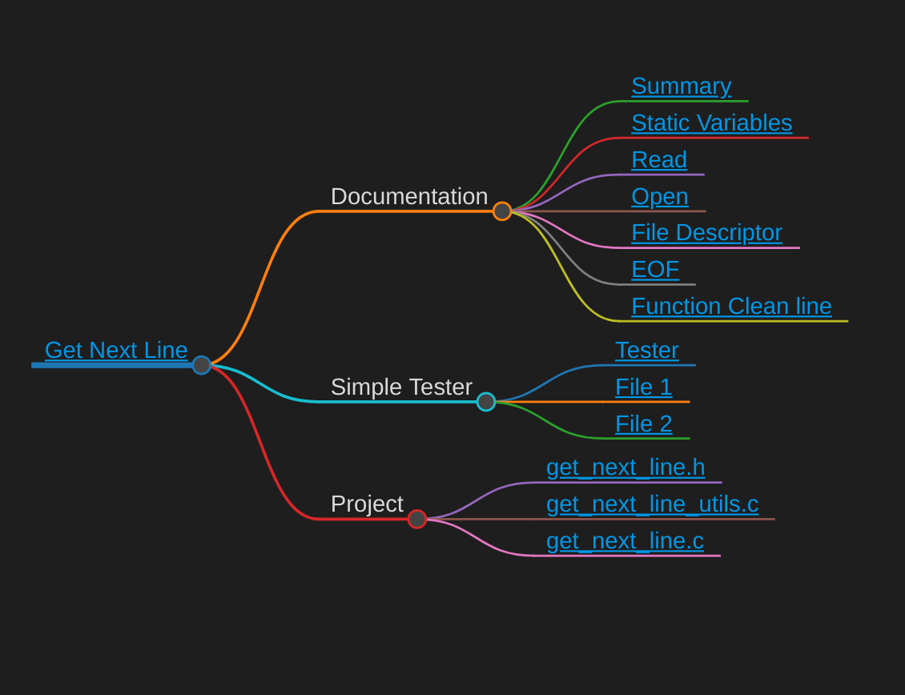

# 42get_next_line
*Function to read a content line by line.*

Project | Skills | Grade | 
:------:|:------:|:-----:|
GET_NEXT_LINE | [Unix] [Algorithms & AI] [Rigor] | 

### *Access to the [interactive map](https://faleite.github.io/getnextline).*
